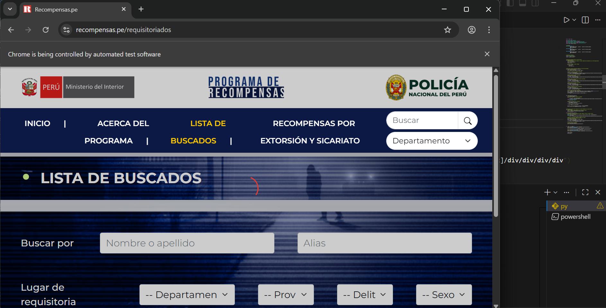
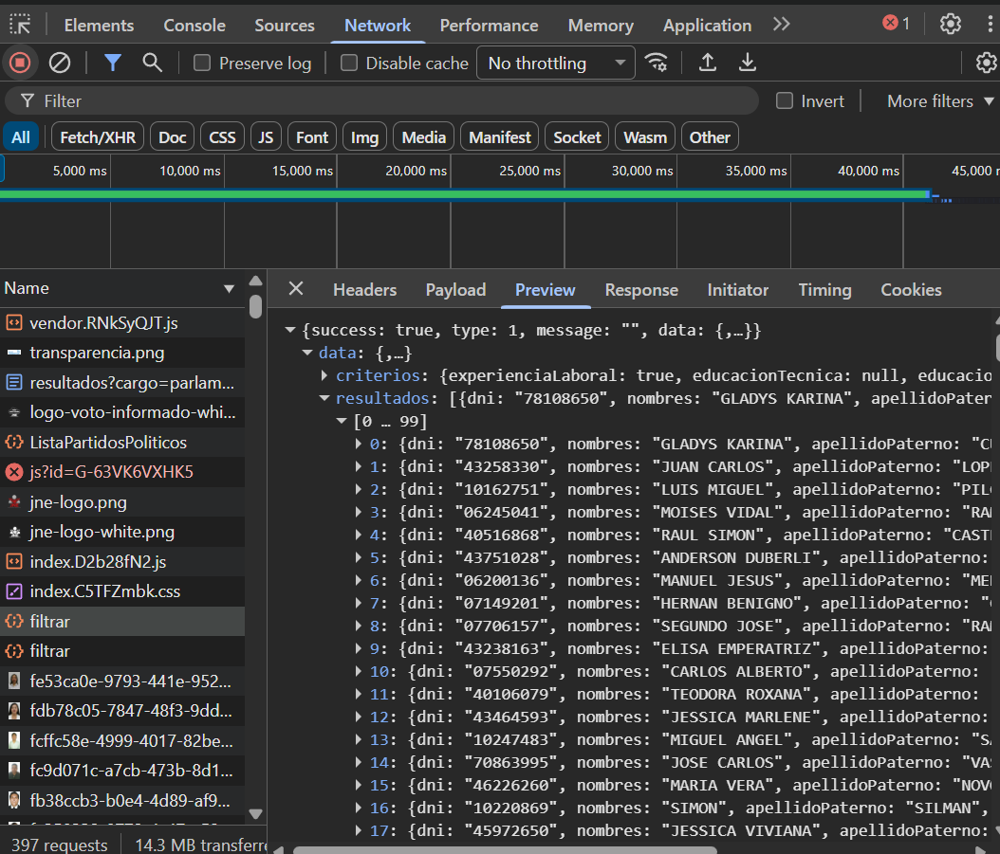
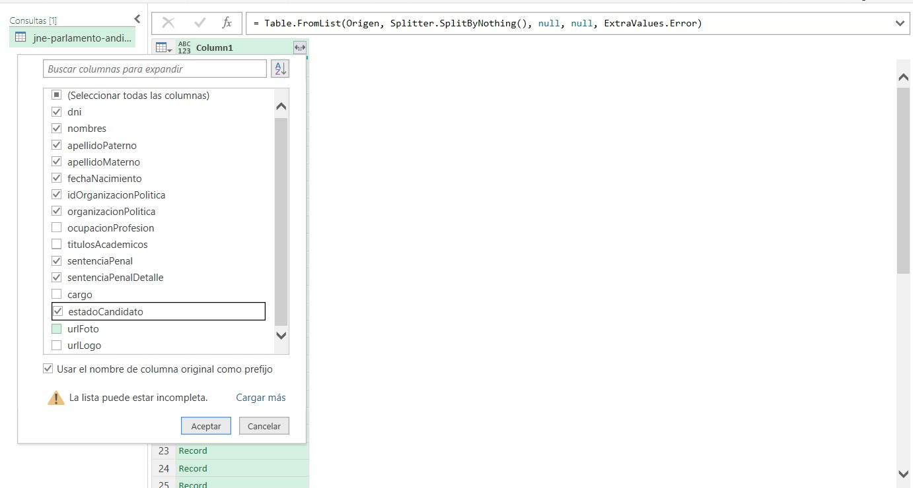
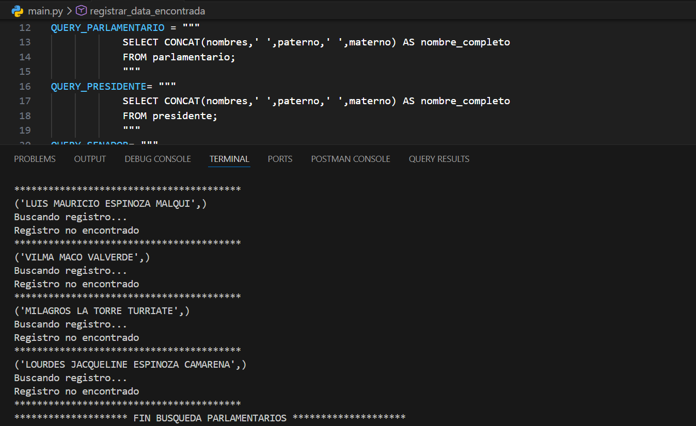

# Proyecto ETL y scrapping

Proyecto de Extraccion de informacion sobre candidatos a las elecciones generales 2026 en Peru y registro en base de datos de los candidatos. Scrapping para validacion de ordenes de captura con recompensa y deudas coactivas en sunat de los candidatos.

`Nota: el proyecto continua en mejora, se plantea implementar validacion de candidatos con REINFO`



## Procesos:

- En este proyecto se extrajo manualmente información sobre candidatos a la presidencia, senado, parlamento andino y otros, desde la página oficial del Jurado Nacional de Elecciones (JNE). La extracción de la data se logró a través de la inspección de la página y la recuperación de la información devuelta en la respuesta del navegador en formato JSON.



- La data previamente extraída necesitara ser insertada en una base de datos, así que se creó la base de datos 'most-wanted' y la tablas 'partido','presidente','parlamentario', 'buscado' y otras.

- En Excel se convirtió la data extraída de formato JSON a una tabla de Excel. Con esta tabla se aplicó una fórmula de concatenación para generar un query SQL de inserción en las tablas 'partido', 'presidente', 'parlamentario' y otras.



- Se creo un proyecto Python con conexión a base de datos Potgres. Desde el proyecto se consultó los candidatos registrados en la base de datos y mediante Scrapping con Selenium se validó uno a uno si cuentan con órdenes de captura con recompensa y deudas coactivas en SUNAT. En caso se encuentre algún candidato con órdenes de captura con recompensa y deudas coactivas se registra en base de datos.



## Requerimientos:

- [x] Conexion a una BD (PostgreSQL).
- [x] Tablas de datos crudos, transformados y validados.
- [x] Scrapping a pagina de publica de recompensas PNP (https://recompensas.pe/requisitoriados).
- [x] Scrapping a pagina de publica de SUNAT (https://e-consultaruc.sunat.gob.pe/cl-ti-itmrconsruc/FrameCriterioBusquedaWeb.jsp).
- [ ] Scrapping a pagina de publica de REINFO (https://pad.minem.gob.pe/REINFO_WEB/Index.aspx).

## Base de Datos:

- Creacion de tablas.

`Nota: el proyecto continua en mejora, se planea crear mas tablas para candidatos y data transformada`

```sql
CREATE TABLE partido (
    id_partido INT PRIMARY KEY,
    partido_politico VARCHAR(150) NOT NULL
);

CREATE TABLE parlamentario (
    dni INT PRIMARY KEY,
    nombres VARCHAR(150) NOT NULL,
    paterno VARCHAR(150) NOT NULL,
    materno VARCHAR(150) NOT NULL,
	id_partido INT REFERENCES partido(id_partido),
	sentencia_penal VARCHAR(150),
	estado VARCHAR(100)
);

CREATE TABLE presidente (
    dni INT PRIMARY KEY,
    nombres VARCHAR(150) NOT NULL,
    paterno VARCHAR(150) NOT NULL,
    materno VARCHAR(150) NOT NULL,
	id_partido INT REFERENCES partido(id_partido),
	sentencia_penal VARCHAR(150),
	estado VARCHAR(100)
);

CREATE TABLE buscado (
    id_buscado SERIAL PRIMARY KEY,
    nombres VARCHAR(250) NOT NULL,
	estado VARCHAR(250) NOT NULL,
	lugar_rq VARCHAR(250) NOT NULL,
	delito VARCHAR(250) NOT NULL,
	recompensa VARCHAR(100) NOT NULL
);
```

## Tecnologias:

- Python 3.11.9 
- Selenium 4.13.0
- Postgres 16.0
- Chrome Driver 146.0.7680.80